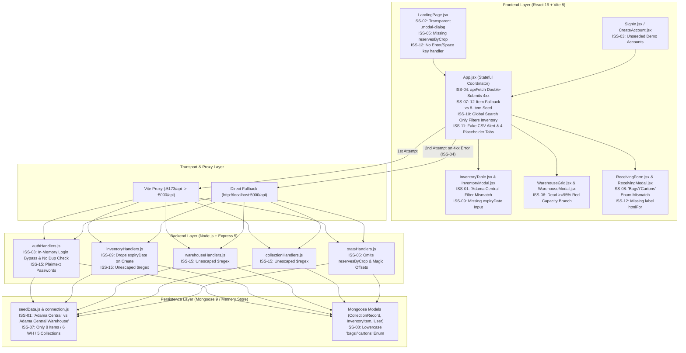
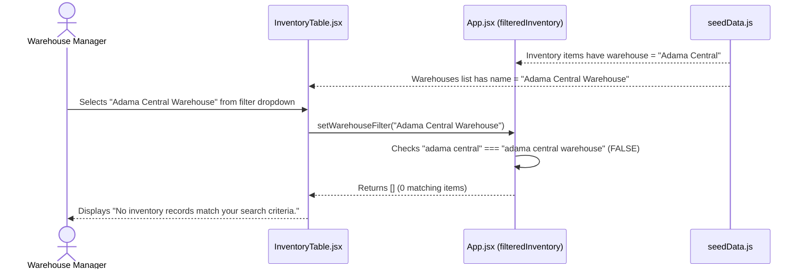
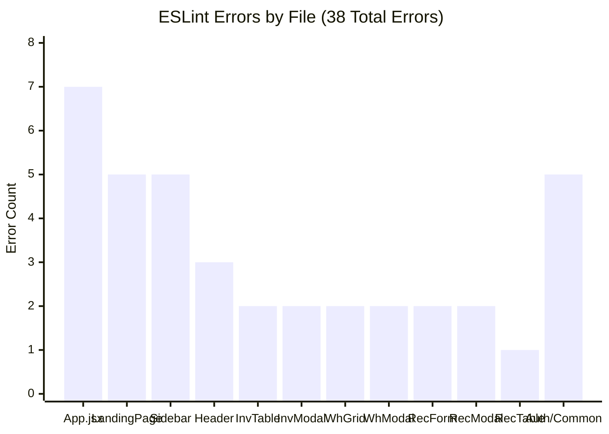
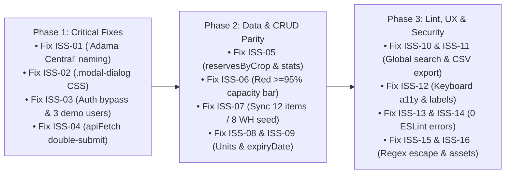

# Gotera: Comprehensive Technical Audit & Defect Analysis Report

**System Under Test (SUT):** Gotera — National Emergency Food Reserve Management System  
**Repository Path:** [Gotera-master](file:///C:/Users/bilea/Downloads/Gotera-master)  
**Audit Standard:** ISO/IEC 25010 (Software Product Quality) · IEEE 1028 (Software Reviews & Audits) · OWASP Top 10 · WCAG 2.1 AA  
**Audit Date:** September 30, 2026  

---

## 1. Executive Summary & System Health Scorecard

**Gotera** is a full-stack web application built with **React 19 + Vite 8** on the frontend ([client/](file:///C:/Users/bilea/Downloads/Gotera-master/client/package.json)) and **Node.js + Express 5 + Mongoose 9** on the backend ([server/](file:///C:/Users/bilea/Downloads/Gotera-master/server/package.json)). It is designed to manage Ethiopia's strategic grain reserves across three primary operational domains: **Food Inventory**, **Regional Warehouses**, and **Receiving / Food Collection**, alongside a public-facing **Landing Portal** and **Authentication System**.

While the application compiles cleanly (`vite build` succeeds in `1.19s`) and features a cohesive custom CSS design system, a deep-dive static, dynamic, and architectural audit uncovered **16 distinct technical issues** (spanning functional bugs, broken visual modals, data-layer desynchronization, security vulnerabilities, accessibility gaps, and **38 ESLint errors**).

> [!IMPORTANT]
> **Key Audit Takeaway:** The most disruptive issues arise from **divergent dual-mode code paths**—where the frontend fallback state ([App.jsx](file:///C:/Users/bilea/Downloads/Gotera-master/client/src/App.jsx)), the backend in-memory store ([connection.js](file:///C:/Users/bilea/Downloads/Gotera-master/server/db/connection.js) / [seedData.js](file:///C:/Users/bilea/Downloads/Gotera-master/server/db/seedData.js)), and the Mongoose schema layer ([server/models/](file:///C:/Users/bilea/Downloads/Gotera-master/server/models/InventoryItem.js)) enforce different naming conventions, enum casing, and authentication rules.

### System Quality Scorecard (ISO/IEC 25010)

| Quality Dimension | Rating | Status | Key Observation |
| :--- | :---: | :---: | :--- |
| **Functional Suitability** | **6.2 / 10** | ⚠️ Needs Work | Core CRUD works, but warehouse filtering breaks on `'Adama Central'`, 4 sidebar modules are placeholders, and `apiFetch` double-submits on 4xx errors. |
| **UI / Visual Integrity** | **7.4 / 10** | ⚠️ Needs Work | Dashboard & Landing page aesthetics are strong, but Landing Page `About`/`Contact` modals use a non-existent `.modal-dialog` class (rendering transparent), and critical `>=95%` capacity bars never turn red. |
| **Data Consistency** | **5.5 / 10** | 🔴 At Risk | `App.jsx` starts with 12 items / 8 warehouses / 7 collections, then drops to 8 items / 6 warehouses / 5 collections when `/api` responds; `/api/stats/overview` wipes out `reservesByCrop`. |
| **Code Quality & Maintainability** | **5.8 / 10** | ⚠️ Needs Work | `npm run lint` fails with **38 errors** (`react-hooks/set-state-in-effect`, unused imports/vars, empty catch blocks); 1.1 MB hero image is duplicated in `public/` and `src/assets/`. |
| **Security & Resilience** | **4.8 / 10** | 🔴 At Risk | In-memory login bypasses password checks completely; passwords stored in plaintext; unescaped `$regex` queries allow ReDoS/NoSQL regex injection. |
| **Accessibility (WCAG 2.1)** | **7.0 / 10** | ⚠️ Needs Work | Good semantic landmarks, but Landing Page feature cards lack keyboard `Enter`/`Space` handlers and `ReceivingModal` lacks `<label htmlFor>` bindings. |

---

## 2. Fault Topology & System Architecture Diagram

The diagram below maps the full-stack request lifecycle of **Gotera** and pinpoints where each audited issue (`ISS-01` through `ISS-16`) occurs across the architecture.



---

## 3. Master Issue Registry

All 16 observed issues are classified below by **Severity**, **Layer**, **Location**, and **Primary Trigger**.

| ID | Severity | Category | Title | Primary Location(s) | Trigger / Visibility |
| :--- | :---: | :--- | :--- | :--- | :--- |
| **ISS-01** | 🔴 **Critical** | Data / Filtering | Warehouse Name Mismatch Breaks Inventory Filtering | [seedData.js](file:///C:/Users/bilea/Downloads/Gotera-master/server/db/seedData.js#L13-L107), [InventoryTable.jsx](file:///C:/Users/bilea/Downloads/Gotera-master/client/src/components/Inventory/InventoryTable.jsx#L88-L98) | Selecting `Adama Central Warehouse` in Inventory filter hides all Adama items. |
| **ISS-02** | 🔴 **Critical** | UI / CSS | Transparent & Unstyled "About" and "Contact" Modals | [LandingPage.jsx](file:///C:/Users/bilea/Downloads/Gotera-master/client/src/components/Home/LandingPage.jsx#L408-L485), [components.css](file:///C:/Users/bilea/Downloads/Gotera-master/client/src/styles/components.css#L619) | Clicking **About** or **Contact** on the Landing Page renders dark text over a transparent box. |
| **ISS-03** | 🔴 **Critical** | Auth / Logic | In-Memory Authentication Bypass & Missing Demo Users | [authHandlers.js](file:///C:/Users/bilea/Downloads/Gotera-master/server/handlers/authHandlers.js#L49-L69), [SignIn.jsx](file:///C:/Users/bilea/Downloads/Gotera-master/client/src/components/Auth/SignIn.jsx#L19-L23) | Any invalid password logs in as `Meron Kassa` in memory mode; 2 of 3 demo buttons fail in MongoDB mode. |
| **ISS-04** | 🟠 **High** | Network / API | `apiFetch` Double-Submits Every 4xx/5xx API Error | [App.jsx](file:///C:/Users/bilea/Downloads/Gotera-master/client/src/App.jsx#L30-L39) | Any `400`/`401`/`404` response fires two identical HTTP requests (visible in DevTools Network tab). |
| **ISS-05** | 🟠 **High** | API / State | `/api/stats/overview` Wipes Out `reservesByCrop` & Uses Magic Math | [statsHandlers.js](file:///C:/Users/bilea/Downloads/Gotera-master/server/handlers/statsHandlers.js#L31-L78), [LandingPage.jsx](file:///C:/Users/bilea/Downloads/Gotera-master/client/src/components/Home/LandingPage.jsx#L38-L52) | Adding/editing crops never updates Landing Page crop cards; volume math ignores `L` and `Tonnes`. |
| **ISS-06** | 🟠 **High** | UI Logic | Unreachable `'red'` Critical Warehouse Capacity State | [WarehouseGrid.jsx](file:///C:/Users/bilea/Downloads/Gotera-master/client/src/components/Warehouses/WarehouseGrid.jsx#L18-L22) | Warehouses at `95%–100%` capacity render an amber bar instead of red (`>= 90` shadows `>= 95`). |
| **ISS-07** | 🟠 **High** | Data Parity | Initial Flash & Data Shrinkage Between Client Fallback and Server Seed | [App.jsx](file:///C:/Users/bilea/Downloads/Gotera-master/client/src/App.jsx#L42-L385), [seedData.js](file:///C:/Users/bilea/Downloads/Gotera-master/server/db/seedData.js#L6-L224) | On load, UI flashes 12 items / 8 warehouses / 7 collections, then shrinks to 8 / 6 / 5 when API responds. |
| **ISS-08** | 🟠 **High** | Schema / CRUD | Mongoose Enum Case Mismatch on Collection Units (`Bags`/`Cartons`) | [ReceivingForm.jsx](file:///C:/Users/bilea/Downloads/Gotera-master/client/src/components/Receiving/ReceivingForm.jsx#L41), [CollectionRecord.js](file:///C:/Users/bilea/Downloads/Gotera-master/server/models/CollectionRecord.js#L33) | Submitting a collection with unit `Bags` or `Cartons` throws a `400 Validation Error` on MongoDB. |
| **ISS-09** | 🟡 **Medium** | Feature Gap | Missing `expiryDate` Field in `InventoryModal` & `createItem` Handler | [InventoryModal.jsx](file:///C:/Users/bilea/Downloads/Gotera-master/client/src/components/Inventory/InventoryModal.jsx#L11-L49), [inventoryHandlers.js](file:///C:/Users/bilea/Downloads/Gotera-master/server/handlers/inventoryHandlers.js#L90-L110) | Users cannot input, view, or edit expiration dates when adding/editing food reserve items. |
| **ISS-10** | 🟡 **Medium** | UX / Search | Header Global Search Ignored on Warehouses & Receiving Tabs | [Header.jsx](file:///C:/Users/bilea/Downloads/Gotera-master/client/src/components/Layout/Header.jsx#L74-L84), [App.jsx](file:///C:/Users/bilea/Downloads/Gotera-master/client/src/App.jsx#L719-L729) | Typing in `"Search inventory, warehouses..."` does nothing on Warehouses or Receiving tabs. |
| **ISS-11** | 🟡 **Medium** | Incomplete UI | Placeholder Sidebar Modules & Simulated Export / Map Actions | [App.jsx](file:///C:/Users/bilea/Downloads/Gotera-master/client/src/App.jsx#L852-L890), [StatCards.jsx](file:///C:/Users/bilea/Downloads/Gotera-master/client/src/components/Layout/StatCards.jsx#L20-L118) | 4 sidebar tabs show a static fallback card; "Export Log" and "Map View" trigger `window.alert()`. |
| **ISS-12** | 🟡 **Medium** | Accessibility | Missing Keyboard Handlers on Feature Cards & Unlinked Modal Labels | [LandingPage.jsx](file:///C:/Users/bilea/Downloads/Gotera-master/client/src/components/Home/LandingPage.jsx#L253-L310), [ReceivingModal.jsx](file:///C:/Users/bilea/Downloads/Gotera-master/client/src/components/Receiving/ReceivingModal.jsx#L81-L169) | Focusing a Landing Page card via `Tab` and pressing `Enter`/`Space` does nothing; labels don't focus inputs. |
| **ISS-13** | 🟡 **Medium** | React / Lint | Synchronous `setState` Inside `useEffect` Causing Cascading Renders | [App.jsx](file:///C:/Users/bilea/Downloads/Gotera-master/client/src/App.jsx#L476-L478), [InventoryModal.jsx](file:///C:/Users/bilea/Downloads/Gotera-master/client/src/components/Inventory/InventoryModal.jsx#L24-L49), [WarehouseModal.jsx](file:///C:/Users/bilea/Downloads/Gotera-master/client/src/components/Warehouses/WarehouseModal.jsx#L24-L49), [ReceivingModal.jsx](file:///C:/Users/bilea/Downloads/Gotera-master/client/src/components/Receiving/ReceivingModal.jsx#L22-L35) | Triggers 4 `react-hooks/set-state-in-effect` ESLint errors and double render passes when opening modals. |
| **ISS-14** | 🟢 **Low** | Code Hygiene | 34 Additional ESLint Errors (`no-unused-vars`, `no-empty`) | 13 files across `client/src/` | Running `npm run lint` exits with code `1` (**38 total errors**), breaking CI/CD quality gates. |
| **ISS-15** | 🟠 **High** | Security | Plaintext Passwords, Unprotected Endpoints & Unescaped `$regex` | [authHandlers.js](file:///C:/Users/bilea/Downloads/Gotera-master/server/handlers/authHandlers.js), [inventoryHandlers.js](file:///C:/Users/bilea/Downloads/Gotera-master/server/handlers/inventoryHandlers.js#L27-L31) | Searching `[` on MongoDB throws a `500 MongoServerError: Regular expression is invalid`; passwords stored unhashed. |
| **ISS-16** | 🟢 **Low** | Performance | Duplicated 1.1 MB Hero Image & Dead Vite Starter Boilerplate | `client/public/` & `client/src/assets/`, [App.css](file:///C:/Users/bilea/Downloads/Gotera-master/client/src/App.css) | Production `dist/` bundles two copies of `grain_warehouse_hero.jpg` (`2.2 MB` total) and unused SVGs/CSS. |

---

## 4. Deep-Dive Technical Analysis of Observed Issues

Each issue below is documented with its **Root Cause (Why It Happened)**, **Code Location (Where It Is)**, **Visual & Interactive Manifestation (How It Appears / What Triggers It)**, and **Remediation Blueprint**.

---

### ISS-01 · Warehouse Name Mismatch Breaks Inventory Filtering & Modal Selection
* **Severity:** 🔴 **Critical**
* **Category:** Data Integrity & UI Filtering
* **Locations:**
  * [seedData.js](file:///C:/Users/bilea/Downloads/Gotera-master/server/db/seedData.js#L13) (`warehouse: 'Adama Central'` vs. line 107 `name: 'Adama Central Warehouse'`)
  * [InventoryTable.jsx](file:///C:/Users/bilea/Downloads/Gotera-master/client/src/components/Inventory/InventoryTable.jsx#L88-L98) (Warehouse filter `<select>`)
  * [App.jsx](file:///C:/Users/bilea/Downloads/Gotera-master/client/src/App.jsx#L721) (`filteredInventory` predicate)
  * [InventoryModal.jsx](file:///C:/Users/bilea/Downloads/Gotera-master/client/src/components/Inventory/InventoryModal.jsx#L17) & [ReceivingForm.jsx](file:///C:/Users/bilea/Downloads/Gotera-master/client/src/components/Receiving/ReceivingForm.jsx#L17)

#### Why It Happened (Root Cause)
In [seedData.js](file:///C:/Users/bilea/Downloads/Gotera-master/server/db/seedData.js), the warehouse entity is named `'Adama Central Warehouse'` (line 107), but the inventory items stored in that warehouse (`Wheat Grain` on line 13 and `Red Beans` on line 85) and the collection record (`GC-2026-1187` on line 175) reference the shortened string `'Adama Central'`.

Meanwhile, [InventoryTable.jsx](file:///C:/Users/bilea/Downloads/Gotera-master/client/src/components/Inventory/InventoryTable.jsx#L95-L97) dynamically populates its Warehouse filter dropdown using `warehousesList` (`w.name`), which generates `<option value="Adama Central Warehouse">Adama Central Warehouse</option>`. When filtering in [App.jsx](file:///C:/Users/bilea/Downloads/Gotera-master/client/src/App.jsx#L721), strict case-insensitive equality is used:

```javascript
// client/src/App.jsx (Lines 720-721)
const matchCat = categoryFilter === 'All' || item.category?.toLowerCase() === categoryFilter.toLowerCase();
const matchWh = warehouseFilter === 'All' || item.warehouse?.toLowerCase() === warehouseFilter.toLowerCase();
```

Because `'adama central' !== 'adama central warehouse'`, the comparison fails.

#### How It Manifests & How It Is Visible
1. Sign in and navigate to **Food Inventory**.
2. Observe in the table that **Wheat Grain** (`25,430 t`) and **Red Beans** (`6,450 t`) display `Adama Central` in the **WAREHOUSE** column.
3. Click the **Warehouse: All** dropdown filter in the table toolbar and select **Adama Central Warehouse**.
4. **Visual Result:** The table immediately empties and displays *"No inventory records match your search criteria"*, even though Adama Central holds `31,880 t` (over 53% of the national reserve)!
5. Furthermore, if you click the **Edit** (pencil) button on **Wheat Grain**, the **Warehouse Facility** `<select>` in [InventoryModal.jsx](file:///C:/Users/bilea/Downloads/Gotera-master/client/src/components/Inventory/InventoryModal.jsx#L227-L238) cannot match `formData.warehouse` (`'Adama Central'`) to any `<option>` in `warehousesList` (which only has `'Adama Central Warehouse'`), causing the select box to appear blank or snap to an unintended value.



#### Remediation Blueprint
Normalize `'Adama Central'` to `'Adama Central Warehouse'` across [seedData.js](file:///C:/Users/bilea/Downloads/Gotera-master/server/db/seedData.js#L13), [InventoryModal.jsx](file:///C:/Users/bilea/Downloads/Gotera-master/client/src/components/Inventory/InventoryModal.jsx#L17), and [ReceivingForm.jsx](file:///C:/Users/bilea/Downloads/Gotera-master/client/src/components/Receiving/ReceivingForm.jsx#L17).

---

### ISS-02 · Transparent & Unstyled "About" and "Contact" Modals on Landing Page
* **Severity:** 🔴 **Critical**
* **Category:** UI / CSS Styling Defect
* **Locations:**
  * [LandingPage.jsx](file:///C:/Users/bilea/Downloads/Gotera-master/client/src/components/Home/LandingPage.jsx#L408-L485) (Lines 410, 415, 447, 452)
  * [components.css](file:///C:/Users/bilea/Downloads/Gotera-master/client/src/styles/components.css#L619-L662)

#### Why It Happened (Root Cause)
In [components.css](file:///C:/Users/bilea/Downloads/Gotera-master/client/src/styles/components.css#L619-L627), the modal container card class is defined as `.modal-content`, and the circular close button is `.modal-close-btn`. All dashboard modals ([InventoryModal.jsx](file:///C:/Users/bilea/Downloads/Gotera-master/client/src/components/Inventory/InventoryModal.jsx#L102), [WarehouseModal.jsx](file:///C:/Users/bilea/Downloads/Gotera-master/client/src/components/Warehouses/WarehouseModal.jsx#L106), [ReceivingModal.jsx](file:///C:/Users/bilea/Downloads/Gotera-master/client/src/components/Receiving/ReceivingModal.jsx#L62), [ConfirmDialog.jsx](file:///C:/Users/bilea/Downloads/Gotera-master/client/src/components/Common/ConfirmDialog.jsx#L14)) use `<div className="modal-content">`.

However, [LandingPage.jsx](file:///C:/Users/bilea/Downloads/Gotera-master/client/src/components/Home/LandingPage.jsx#L410) uses `<div className="modal-dialog">`—a CSS class that **does not exist anywhere in the project's stylesheets**:

```jsx
// client/src/components/Home/LandingPage.jsx (Lines 408-420)
{showInfoModal === 'about' && (
  <div className="modal-backdrop" onClick={() => setShowInfoModal(null)}>
    <div className="modal-dialog" onClick={(e) => e.stopPropagation()} style={{ maxWidth: '580px' }}>
      <div className="modal-header">
        <h2 className="modal-title">About GOTERA Food Reserve System</h2>
        <button type="button" className="btn-icon" onClick={() => setShowInfoModal(null)}>
```

#### How It Manifests & How It Is Visible
1. Open the public Landing Page (`http://localhost:5173/`, or click **Home Portal** from the dashboard).
2. Click **About** or **Contact** in the top navigation bar or the page footer.
3. **Visual Result:**
   * The screen dims with the blurred dark green `.modal-backdrop` (`rgba(13, 56, 44, 0.45)`).
   * Because `.modal-dialog` has no CSS rules (`background-color`, `border-radius`, `box-shadow`, `overflow` are all missing), the modal header and body are **completely transparent**.
   * The dark charcoal text (`#141e1a`) of the title and paragraph floats directly over the dark blurred green backdrop, making it nearly illegible.
   * Meanwhile, `.modal-footer` has its own `background-color: #fafbfa` in [components.css](file:///C:/Users/bilea/Downloads/Gotera-master/client/src/styles/components.css#L673), so a detached white rectangular bar appears floating beneath the transparent text!

#### Remediation Blueprint
Replace `className="modal-dialog"` with `className="modal-content"` (and optionally alias `.modal-dialog, .modal-content` in [components.css](file:///C:/Users/bilea/Downloads/Gotera-master/client/src/styles/components.css#L619)) and replace `className="btn-icon"` with `className="modal-close-btn"` in [LandingPage.jsx](file:///C:/Users/bilea/Downloads/Gotera-master/client/src/components/Home/LandingPage.jsx#L410-L455).

---

### ISS-03 · In-Memory Authentication Bypass, Missing Demo Accounts & Duplicate Registration
* **Severity:** 🔴 **Critical**
* **Category:** Authentication & Business Logic
* **Locations:**
  * [authHandlers.js](file:///C:/Users/bilea/Downloads/Gotera-master/server/handlers/authHandlers.js#L43-L69) (`exports.login`) & [authHandlers.js](file:///C:/Users/bilea/Downloads/Gotera-master/server/handlers/authHandlers.js#L129-L147) (`exports.register`)
  * [SignIn.jsx](file:///C:/Users/bilea/Downloads/Gotera-master/client/src/components/Auth/SignIn.jsx#L19-L23) (`demoAccounts`)
  * [seedData.js](file:///C:/Users/bilea/Downloads/Gotera-master/server/db/seedData.js#L226-L236) (`seedUsers`)

#### Why It Happened (Root Cause)
There are three compounding defects in the authentication flow:

1. **Unconditional Login Bypass in Memory Mode:** In [authHandlers.js](file:///C:/Users/bilea/Downloads/Gotera-master/server/handlers/authHandlers.js#L49-L69), when a user is not found or the password does not match (`if (!user || user.password !== password)`), an inner `if (email && password)` block immediately returns HTTP `200 OK` with a hardcoded `Meron Kassa` user object. Because `if (!email || !password)` was already checked on line 15, `email && password` is **always truthy** at line 51—making line 65 (`return res.status(401)...`) 100% dead code!

```javascript
// server/handlers/authHandlers.js (Lines 49-69)
if (!user || user.password !== password) {
  // BUG: email && password is ALWAYS true here because of line 15!
  if (email && password) {
    return res.status(200).json({
      success: true,
      user: {
        id: 'usr_meron',
        fullName: 'Meron Kassa',
        email: email,
        role: 'Warehouse Manager',
        organization: 'National Food Reserve Agency',
        avatar: 'MK'
      }
    });
  }
  // UNREACHABLE DEAD CODE:
  return res.status(401).json({
    success: false,
    message: 'Invalid credentials'
  });
}
```

2. **Missing Demo Accounts in Seed Data:** [SignIn.jsx](file:///C:/Users/bilea/Downloads/Gotera-master/client/src/components/Auth/SignIn.jsx#L19-L23) provides three quick-fill buttons:
   * `Warehouse Manager` (`meron.kassa@gotera.gov.et` / `Password123!`)
   * `Administrator` (`admin@gotera.gov.et` / `Admin123!`)
   * `Relief Coordinator` (`coordinator@gotera.gov.et` / `Coordinator123!`)
   However, [seedData.js](file:///C:/Users/bilea/Downloads/Gotera-master/server/db/seedData.js#L226-L236) only seeds **Meron Kassa**.
   * In **MongoDB mode**, clicking `Administrator` or `Relief Coordinator` and clicking **Sign In** fails with `401 Invalid credentials`.
   * In **In-Memory mode**, clicking `Administrator` (`admin@gotera.gov.et`) hits the fallback bug above and logs the user in with the name **`Meron Kassa`** and role **`Warehouse Manager`** instead of an Administrator!

3. **No Duplicate Email Check in In-Memory Registration:** In [authHandlers.js](file:///C:/Users/bilea/Downloads/Gotera-master/server/handlers/authHandlers.js#L110-L135), the MongoDB branch checks `const existing = await User.findOne({ email: userData.email })`, but the in-memory branch (lines 129–136) pushes `newDoc` directly into `store` without checking if the email already exists.

#### How It Manifests & How It Is Visible
* **Trigger 1:** Go to **Sign In**, click the **Administrator** pill (`admin@gotera.gov.et`), and click **Sign In**. Look at the top-right profile chip or bottom-left sidebar badge: you are logged in as **Meron Kassa (Warehouse Manager)** instead of an Administrator!
* **Trigger 2:** Type `wrong@email.com` and password `wrongpassword` on the Sign In screen. Instead of showing an error banner, the app logs you straight into the dashboard as `Meron Kassa`.

#### Remediation Blueprint
1. Seed all three demo accounts (`Warehouse Manager`, `Administrator`, `Relief Coordinator`) in [seedData.js](file:///C:/Users/bilea/Downloads/Gotera-master/server/db/seedData.js#L226-L236).
2. Remove the `if (email && password)` bypass in [authHandlers.js](file:///C:/Users/bilea/Downloads/Gotera-master/server/handlers/authHandlers.js#L51-L64) so invalid credentials properly return `401 Invalid credentials`.
3. Add a duplicate-email check in the in-memory branch of `exports.register`.

---

### ISS-04 · `apiFetch` Double-Submits Every 4xx/5xx API Response
* **Severity:** 🟠 **High**
* **Category:** Network & API Client Architecture
* **Location:** [App.jsx](file:///C:/Users/bilea/Downloads/Gotera-master/client/src/App.jsx#L30-L39)

#### Why It Happened (Root Cause)
`apiFetch` is designed to try the Vite dev proxy (`/api`) first and fall back to `http://localhost:5000/api` if the proxy is unreachable. However, it checks `if (res.ok)` (`status 200–299`) before returning:

```javascript
// client/src/App.jsx (Lines 30-39)
async function apiFetch(endpoint, options = {}) {
  try {
    const res = await fetch(`${API_PRIMARY}${endpoint}`, options);
    if (res.ok) return await res.json();
  } catch (err) {
    // Try explicit localhost:5000
  }
  const fallbackRes = await fetch(`${API_FALLBACK}${endpoint}`, options);
  return await fallbackRes.json();
}
```

When the backend legitimately responds with HTTP `400 Bad Request` (validation failure or duplicate email), `401 Unauthorized` (bad password), or `404 Not Found`, `res.ok` is `false`. Execution exits the `if (res.ok)` branch and **immediately fires a second identical HTTP request** to `http://localhost:5000/api`!

#### How It Manifests & How It Is Visible
1. Open Chrome DevTools (**Network** tab) and trigger any validation error or invalid login.
2. **Visual Result:** Every failed request appears **twice** in the Network log (once to `http://localhost:5173/api/...` and once to `http://localhost:5000/api/...`), doubling server load and log entries in the backend terminal (`[Gotera Server] POST /api/...`).

#### Remediation Blueprint
Return the parsed JSON whenever the server responds with a valid JSON payload (even on `400`/`401`/`404`), and only fall back to `API_FALLBACK` when `fetch` throws a network error or when the Vite proxy returns a `502`/`504` non-JSON gateway error.

---

### ISS-05 · `/api/stats/overview` Wipes Out `reservesByCrop` & Uses Hardcoded Offset Math
* **Severity:** 🟠 **High**
* **Category:** API Contract & Metric Accuracy
* **Locations:**
  * [statsHandlers.js](file:///C:/Users/bilea/Downloads/Gotera-master/server/handlers/statsHandlers.js#L31-L78)
  * [App.jsx](file:///C:/Users/bilea/Downloads/Gotera-master/client/src/App.jsx#L413-L439) & [App.jsx](file:///C:/Users/bilea/Downloads/Gotera-master/client/src/App.jsx#L468)
  * [LandingPage.jsx](file:///C:/Users/bilea/Downloads/Gotera-master/client/src/components/Home/LandingPage.jsx#L38-L52)

#### Why It Happened (Root Cause)
1. **Missing `reservesByCrop` in Server Response:** In [App.jsx](file:///C:/Users/bilea/Downloads/Gotera-master/client/src/App.jsx#L433-L438), initial state includes `stats.reservesByCrop = { wheat: 25430, rice: 18200, maize: 12800, other: 3240 }`, which [LandingPage.jsx](file:///C:/Users/bilea/Downloads/Gotera-master/client/src/components/Home/LandingPage.jsx#L38-L52) reads to populate the 4 **Food Reserve Overview** cards at the bottom of the Home page. However, `getOverviewStats` in [statsHandlers.js](file:///C:/Users/bilea/Downloads/Gotera-master/server/handlers/statsHandlers.js#L55-L78) returns `{ inventory, warehouses, receiving }` and **completely omits `reservesByCrop`**. As soon as `fetchAllData()` runs on mount (`setStats(statsData.data)`), `stats.reservesByCrop` becomes `undefined`, forcing `LandingPage.jsx` onto static hardcoded strings forever.
2. **Hardcoded Baseline Offsets & Ignored Units:** In [statsHandlers.js](file:///C:/Users/bilea/Downloads/Gotera-master/server/handlers/statsHandlers.js#L32-L38):
   ```javascript
   const totalLineItems = inventoryItems.length > 0 ? 1480 + inventoryItems.length - 8 : 1482;
   const realSumVolume = inventoryItems.reduce((acc, curr) => {
     if (curr.unit === 't') return acc + curr.quantity;
     if (curr.unit === 'kg') return acc + (curr.quantity / 1000);
     return acc;
   }, 0);
   const totalVolumeFormatted = `${(59670 + Math.round(realSumVolume) - 59711).toLocaleString()} t`;
   ```
   Because `realSumVolume` of the 8 seed items equals `62,884.43 t` (`25430 + 18200 + 12800 + 6450 + 3.2 + 0.82 + 0.41`), `59670 + 62884 - 59711` produces `62,843 t`, which matches neither the initial fallback (`82,393 t`) nor the mockup (`59,670 t`).

#### How It Manifests & How It Is Visible
1. Sign in, add `10,000 t` of **Wheat Grain** in **Food Inventory**, and click **Home Portal** to return to the Landing Page.
2. **Visual Result:** The **Wheat** card under **Food Reserve Overview** still displays the static string `25,430 t` instead of `35,430 t`.

---

### ISS-06 · Unreachable `'red'` Critical Capacity Color in `WarehouseGrid.jsx`
* **Severity:** 🟠 **High**
* **Category:** UI Logic Bug (Dead Branch)
* **Location:** [WarehouseGrid.jsx](file:///C:/Users/bilea/Downloads/Gotera-master/client/src/components/Warehouses/WarehouseGrid.jsx#L18-L22)

#### Why It Happened (Root Cause)
In `getCapacityColorClass`, the less-restrictive condition `percent >= 90` is placed **before** `percent >= 95`:

```javascript
// client/src/components/Warehouses/WarehouseGrid.jsx (Lines 18-22)
const getCapacityColorClass = (percent) => {
  if (percent >= 90) return 'amber';
  if (percent >= 95) return 'red'; // <-- UNREACHABLE! Any number >= 95 is already >= 90
  return 'green';
};
```

Although `.capacity-fill.red { background-color: #ef4444; }` is styled in [components.css](file:///C:/Users/bilea/Downloads/Gotera-master/client/src/styles/components.css#L470-L472), it can never be returned.

#### How It Manifests & How It Is Visible
1. Navigate to the **Warehouses** tab.
2. Look at **Hawassa Hub** (`4,100 t` / `4,315 t` = **95% capacity used**) or edit any warehouse so its stock is `100%` of capacity.
3. **Visual Result:** The progress bar remains orange/amber (`#f59e0b`) instead of turning critical red (`#ef4444`).

#### Remediation Blueprint
Check `if (percent >= 95) return 'red';` **before** `if (percent >= 80)` or `if (percent >= 90)`.

---

### ISS-07 · Initial Flash & Data Shrinkage Between Client Fallback and Server Seed
* **Severity:** 🟠 **High**
* **Category:** State Synchronization & Data Parity
* **Locations:**
  * [App.jsx](file:///C:/Users/bilea/Downloads/Gotera-master/client/src/App.jsx#L42-L385) (`initialInventoryFallback`: 12 items, `initialWarehousesFallback`: 8 warehouses, `initialCollectionsFallback`: 7 records)
  * [seedData.js](file:///C:/Users/bilea/Downloads/Gotera-master/server/db/seedData.js#L6-L224) (`seedInventory`: 8 items, `seedWarehouses`: 6 warehouses, `seedCollections`: 5 records)

#### Why It Happened (Root Cause)
The frontend fallback arrays in [App.jsx](file:///C:/Users/bilea/Downloads/Gotera-master/client/src/App.jsx) were expanded to 12 items (adding *White Teff Grain*, *Sorghum Grain*, *Food Grade Barley*, *Chickpeas / Split Peas*), 8 warehouses (adding *Kombolcha Strategic Silo* and *Jigjiga Regional Store*), and 7 collection records, while the backend [seedData.js](file:///C:/Users/bilea/Downloads/Gotera-master/server/db/seedData.js) was left at an older 8-item / 6-warehouse / 5-collection dataset with different item names (e.g., `'Wheat Grain'` vs `'Durum Wheat Grain'`).

#### How It Manifests & How It Is Visible
1. Refresh the dashboard (`F5`) while signed in.
2. **Visual Result:** For the first ~100ms before `/api` responds, the subtitle reads *"12 active strategic crop line items"* and the table shows *Durum Wheat Grain*, *White Teff Grain*, *Sorghum Grain*, etc. As soon as `fetchAllData()` resolves, 4 crops, 2 warehouses (*Kombolcha* and *Jigjiga*), and 2 collection records vanish from the screen and the subtitle drops to *"8 active strategic crop line items"*.

---

### ISS-08 · Mongoose Enum Case Mismatch on Collection Units (`Bags` / `Cartons`) & Missing Unit Field in `ReceivingModal`
* **Severity:** 🟠 **High**
* **Category:** Schema Validation & Form Completeness
* **Locations:**
  * [ReceivingForm.jsx](file:///C:/Users/bilea/Downloads/Gotera-master/client/src/components/Receiving/ReceivingForm.jsx#L41) (`const units = ['Tonnes', 'Kilograms', 'Litres', 'Bags', 'Cartons'];`)
  * [CollectionRecord.js](file:///C:/Users/bilea/Downloads/Gotera-master/server/models/CollectionRecord.js#L33) (`enum: ['t', 'Tonnes', 'kg', 'Kilograms', 'L', 'Litres', 'bags', 'cartons']`)
  * [ReceivingModal.jsx](file:///C:/Users/bilea/Downloads/Gotera-master/client/src/components/Receiving/ReceivingModal.jsx#L90-L114)

#### Why It Happened (Root Cause)
1. [CollectionRecord.js](file:///C:/Users/bilea/Downloads/Gotera-master/server/models/CollectionRecord.js#L33) includes both lowercase and capitalized variants for `'t'`/`'Tonnes'`, `'kg'`/`'Kilograms'`, and `'L'`/`'Litres'`, but only includes lowercase `'bags'` and `'cartons'`. Meanwhile, [ReceivingForm.jsx](file:///C:/Users/bilea/Downloads/Gotera-master/client/src/components/Receiving/ReceivingForm.jsx#L41) submits capitalized `'Bags'` and `'Cartons'`.
2. Additionally, when viewing or editing a Collection Record in [ReceivingModal.jsx](file:///C:/Users/bilea/Downloads/Gotera-master/client/src/components/Receiving/ReceivingModal.jsx#L90-L114), there is **no input or select field for `unit`**—only `quantity` is rendered!

#### How It Manifests & How It Is Visible
* When connected to MongoDB, selecting **Bags** or **Cartons** in the **New Collection Record** form and clicking **Log Collection** fails with a `400 Validation Error` (`'Bags' is not a valid enum value for path 'unit'`).
* When clicking **View** or **Edit** on a collection record in **Receiving / Collection**, the unit (`t`, `L`, `Tonnes`) is hidden from the modal form.

---

### ISS-09 · Missing `expiryDate` Field in `InventoryModal.jsx` and `inventoryHandlers.createItem`
* **Severity:** 🟡 **Medium**
* **Category:** CRUD Completeness
* **Locations:**
  * [InventoryModal.jsx](file:///C:/Users/bilea/Downloads/Gotera-master/client/src/components/Inventory/InventoryModal.jsx#L11-L49)
  * [inventoryHandlers.js](file:///C:/Users/bilea/Downloads/Gotera-master/server/handlers/inventoryHandlers.js#L90-L110)

#### Why It Happened (Root Cause)
Although `expiryDate` is defined in the Mongoose schema ([InventoryItem.js](file:///C:/Users/bilea/Downloads/Gotera-master/server/models/InventoryItem.js#L60-L62)) and populated on every record in [seedData.js](file:///C:/Users/bilea/Downloads/Gotera-master/server/db/seedData.js), [InventoryModal.jsx](file:///C:/Users/bilea/Downloads/Gotera-master/client/src/components/Inventory/InventoryModal.jsx) omits `expiryDate` from `formData` and the form JSX. Furthermore, `exports.createItem` in [inventoryHandlers.js](file:///C:/Users/bilea/Downloads/Gotera-master/server/handlers/inventoryHandlers.js#L90) destructures `{ name, category, subCategory, quantity, unit, warehouse, status, notes }` from `req.body` and omits `expiryDate`.

#### How It Manifests & How It Is Visible
* Clicking **View Details** (eye icon), **Edit** (pencil icon), or **Add Food Item** in **Food Inventory** never shows or allows entering an expiration date, despite the dashboard featuring an **"Expiring Within 30 Days"** KPI card.

---

### ISS-10 · Header Global Search Ignored on Warehouses & Receiving Tabs
* **Severity:** 🟡 **Medium**
* **Category:** UX / Search Behavior
* **Locations:**
  * [Header.jsx](file:///C:/Users/bilea/Downloads/Gotera-master/client/src/components/Layout/Header.jsx#L74-L84) (`placeholder="Search inventory, warehouses..."`)
  * [App.jsx](file:///C:/Users/bilea/Downloads/Gotera-master/client/src/App.jsx#L719-L729), [App.jsx](file:///C:/Users/bilea/Downloads/Gotera-master/client/src/App.jsx#L830-L864)

#### Why It Happened (Root Cause)
`globalSearch` state in [App.jsx](file:///C:/Users/bilea/Downloads/Gotera-master/client/src/App.jsx#L443) is passed to `Header.jsx`, and its placeholder explicitly promises `"Search inventory, warehouses..."`. However:
1. `WarehouseGrid` receives the unfiltered `warehouses` array (`line 831`).
2. `ReceivingTable` receives the unfiltered `collections` array (`line 860`).
3. Even on the `Inventory` tab, line 722 computes `const query = (tableSearch || globalSearch).toLowerCase();`—meaning if a user types anything in the local table search box (`tableSearch`), typing in the top `globalSearch` box is completely ignored!

#### How It Manifests & How It Is Visible
1. Switch to the **Warehouses** tab or **Receiving / Collection** tab.
2. Type `"Mekelle"` or `"WFP"` into the top header search input (`Search inventory, warehouses...`).
3. **Visual Result:** Nothing changes on screen; all warehouses and collection records remain unfiltered.

---

### ISS-11 · Unimplemented Sidebar Modules & Simulated Export / Map Actions
* **Severity:** 🟡 **Medium**
* **Category:** Feature Completeness & UX Consistency
* **Locations:**
  * [App.jsx](file:///C:/Users/bilea/Downloads/Gotera-master/client/src/App.jsx#L852) (`Export Log` button) & [App.jsx](file:///C:/Users/bilea/Downloads/Gotera-master/client/src/App.jsx#L874-L890) (Fallback module card)
  * [WarehouseGrid.jsx](file:///C:/Users/bilea/Downloads/Gotera-master/client/src/components/Warehouses/WarehouseGrid.jsx#L30-L42) (`128 facilities` hardcoded text & `Map View` alert)
  * [StatCards.jsx](file:///C:/Users/bilea/Downloads/Gotera-master/client/src/components/Layout/StatCards.jsx#L20-L118)

#### Why It Happened & How It Manifests
1. **Four Placeholder Sidebar Tabs:** Clicking **Distribution**, **Emergency Requests**, **Reports & Analytics**, or **Users & Roles** in the left sidebar renders a generic placeholder box (`"{TAB} Module — This operational module is linked to the Gotera core registry..."`) with a button to return to Food Inventory.
2. **Mismatched Stat Cards on Placeholder Tabs:** Because [StatCards.jsx](file:///C:/Users/bilea/Downloads/Gotera-master/client/src/components/Layout/StatCards.jsx#L87) only checks `if (activeTab === 'warehouses')` and `if (activeTab === 'receiving')`, clicking **Users & Roles** or **Distribution** still displays the **Food Inventory** KPI cards (`Total Line Items`, `Total Volume`, `Low Stock Items`, `Expiring Within 30 Days`) at the top of the page!
3. **Fake CSV Export Alert:** Clicking **Export Log** on the **Receiving / Food Collection** tab ([App.jsx](file:///C:/Users/bilea/Downloads/Gotera-master/client/src/App.jsx#L852)) triggers a native browser popup `alert('Shipment logs exported to CSV successfully.')` without downloading any file.
4. **Hardcoded Warehouse Subtitle:** [WarehouseGrid.jsx](file:///C:/Users/bilea/Downloads/Gotera-master/client/src/components/Warehouses/WarehouseGrid.jsx#L30) hardcodes `<p className="page-subheadline">128 facilities across 11 regions</p>` instead of reflecting `warehouses.length` (unlike `Food Inventory`, which dynamically displays `{inventoryItems.length} active strategic crop line items`).

---

### ISS-12 · Accessibility (a11y) Gaps: Keyboard Navigation & Unassociated Form Labels
* **Severity:** 🟡 **Medium**
* **Category:** Accessibility (WCAG 2.1 Level A / AA)
* **Locations:**
  * [LandingPage.jsx](file:///C:/Users/bilea/Downloads/Gotera-master/client/src/components/Home/LandingPage.jsx#L253-L310) (4 `.feature-card` elements)
  * [ReceivingModal.jsx](file:///C:/Users/bilea/Downloads/Gotera-master/client/src/components/Receiving/ReceivingModal.jsx#L81-L169) (7 `<label>` elements without `htmlFor`)
  * [InventoryTable.jsx](file:///C:/Users/bilea/Downloads/Gotera-master/client/src/components/Inventory/InventoryTable.jsx#L126) (`<caption style={{ display: 'none' }}>`)

#### Why It Happened & How It Manifests
1. **Non-Interactive Keyboard `role="button"` Cards:** In [LandingPage.jsx](file:///C:/Users/bilea/Downloads/Gotera-master/client/src/components/Home/LandingPage.jsx#L253-L310), the 4 feature cards (`Food Collection`, `Storage Management`, `Distribution`, `Reports`) use `<div className="feature-card" onClick={...} role="button" tabIndex={0}>`. Unlike native `<button>` elements, a `<div role="button">` does **not** fire `onClick` when pressing `Enter` or `Space`. A keyboard user can `Tab` to each card (seeing the green focus ring), but pressing `Enter` or `Space` does nothing.
2. **Unlinked Labels in `ReceivingModal.jsx`:** All 7 `<label className="form-label">` elements in [ReceivingModal.jsx](file:///C:/Users/bilea/Downloads/Gotera-master/client/src/components/Receiving/ReceivingModal.jsx#L81-L169) lack `htmlFor` attributes, and the inputs lack `id` attributes. Clicking a field label does not focus the input, and screen readers cannot associate the label text with the form control.
3. **`display: 'none'` on Table Caption:** In [InventoryTable.jsx](file:///C:/Users/bilea/Downloads/Gotera-master/client/src/components/Inventory/InventoryTable.jsx#L126), `<caption className="sr-only" style={{ display: 'none' }}>` uses `display: none`, which hides the `<caption>` from **screen readers as well as sighted users** (whereas a true `.sr-only` clip pattern keeps it accessible to assistive technologies).

---

### ISS-13 & ISS-14 · Static Analysis Failure: All 38 ESLint Errors Explained
* **Severity:** 🟡 **Medium** (`ISS-13`: React Hook Rules) / 🟢 **Low** (`ISS-14`: Unused Declarations)
* **Category:** Code Quality & React 19 Compliance
* **Command:** `npm run lint` in [client/](file:///C:/Users/bilea/Downloads/Gotera-master/client/eslint.config.js)

Running `npm run lint` exits with code `1` and **38 errors** across 13 files:



#### Breakdown of the 38 Errors
1. **`react-hooks/set-state-in-effect` (4 Errors):**
   * **[App.jsx](file:///C:/Users/bilea/Downloads/Gotera-master/client/src/App.jsx#L476-L478) (Line 477):** `fetchAllData()` is defined outside `useEffect` and calls `setIsLoading(true)` synchronously before `await Promise.all(...)`. React 19's `eslint-plugin-react-hooks` v7 flags synchronous `setState` calls inside effects because they trigger cascading re-renders.
   * **[InventoryModal.jsx](file:///C:/Users/bilea/Downloads/Gotera-master/client/src/components/Inventory/InventoryModal.jsx#L24-L49) (Line 26), [WarehouseModal.jsx](file:///C:/Users/bilea/Downloads/Gotera-master/client/src/components/Warehouses/WarehouseModal.jsx#L24-L49) (Line 26), [ReceivingModal.jsx](file:///C:/Users/bilea/Downloads/Gotera-master/client/src/components/Receiving/ReceivingModal.jsx#L22-L35) (Line 24):** All three modals stay mounted when closed (`if (!isOpen) return null;`) and use `useEffect(() => { setFormData(...); }, [item, mode, isOpen])` to reset form state when opened. Calling `setFormData` synchronously inside `useEffect` causes an extra wasted render frame on every modal open. Passing a `key` prop when mounting the modal (or initializing state from props when mounted conditionally) eliminates the effect and the cascading render entirely.
2. **`no-unused-vars` — Unused `React` Default Imports (13 Errors):**
   * Every file in `client/src/` imports `React` (`import React from 'react'`), which is unused under Vite's automatic React 19 JSX runtime (`react-jsx`) and triggers `no-unused-vars`.
3. **`no-unused-vars` — Unused Icons, State, and Catch Bindings (18 Errors):**
   * [App.jsx](file:///C:/Users/bilea/Downloads/Gotera-master/client/src/App.jsx#L34): `err` (line 34) and `isLoading` (line 440 — assigned by `setIsLoading` but never rendered in the UI).
   * [LandingPage.jsx](file:///C:/Users/bilea/Downloads/Gotera-master/client/src/components/Home/LandingPage.jsx#L16-L21): `Sparkles`, `ArrowRight`, `Info`, `ShieldCheck`.
   * [Sidebar.jsx](file:///C:/Users/bilea/Downloads/Gotera-master/client/src/components/Layout/Sidebar.jsx#L3-L13): `LayoutDashboard`, `User`, `Settings`, `Sparkles`.
   * [Header.jsx](file:///C:/Users/bilea/Downloads/Gotera-master/client/src/components/Layout/Header.jsx#L8): `Bell`, `ChevronDown`.
   * [InventoryTable.jsx](file:///C:/Users/bilea/Downloads/Gotera-master/client/src/components/Inventory/InventoryTable.jsx#L7): `useState`.
   * [ReceivingForm.jsx](file:///C:/Users/bilea/Downloads/Gotera-master/client/src/components/Receiving/ReceivingForm.jsx#L9): `Truck`.
   * [WarehouseGrid.jsx](file:///C:/Users/bilea/Downloads/Gotera-master/client/src/components/Warehouses/WarehouseGrid.jsx#L8): `ShieldCheck`.
4. **`no-empty` — Empty `catch {}` Blocks (3 Errors):**
   * [App.jsx](file:///C:/Users/bilea/Downloads/Gotera-master/client/src/App.jsx#L585) (lines 585, 644, 710): `try { await apiFetch(..., { method: 'DELETE' }); } catch {}` has empty block statements.

---

### ISS-15 · Security Vulnerabilities: Unescaped `$regex`, Plaintext Passwords & Open Routes
* **Severity:** 🟠 **High**
* **Category:** Application Security (OWASP Top 10)
* **Locations:**
  * [inventoryHandlers.js](file:///C:/Users/bilea/Downloads/Gotera-master/server/handlers/inventoryHandlers.js#L26-L32), [warehouseHandlers.js](file:///C:/Users/bilea/Downloads/Gotera-master/server/handlers/warehouseHandlers.js#L24-L30), [collectionHandlers.js](file:///C:/Users/bilea/Downloads/Gotera-master/server/handlers/collectionHandlers.js#L24-L31)
  * [authHandlers.js](file:///C:/Users/bilea/Downloads/Gotera-master/server/handlers/authHandlers.js#L24) & [User.js](file:///C:/Users/bilea/Downloads/Gotera-master/server/models/User.js#L40-L43)

#### Why It Happened & How It Manifests
1. **Unescaped `$regex` Query Injection / Crash:** In `inventoryHandlers.js`, `warehouseHandlers.js`, and `collectionHandlers.js`, user-supplied `req.query.search` is passed directly into MongoDB's `$regex` operator without escaping special regex metacharacters (`[.*+?^${}()|[\]\\]`):
   ```javascript
   // server/handlers/inventoryHandlers.js (Lines 26-31)
   if (search) {
     query.$or = [
       { name: { $regex: search, $options: 'i' } },
       ...
     ];
   }
   ```
   **Trigger:** If MongoDB is connected and a user types an unclosed bracket like `CSB+ (` or `[` in search, MongoDB throws a `500 Internal Server Error` (`Regular expression is invalid: missing )`), or a malicious user can supply catastrophic backtracking patterns (ReDoS).
2. **Plaintext Password Storage:** `User.js` stores `password` in plaintext (`Password123!`) without hashing (e.g., `crypto.scrypt` or `bcryptjs`).
3. **Unauthenticated Write/Delete Endpoints:** Any client can call `DELETE /api/inventory/:id` or `DELETE /api/warehouses/:id` without an `Authorization` header or session token.

---

### ISS-16 · Asset Duplication (`2.2 MB` Hero Image) & Leftover Vite Template Boilerplate
* **Severity:** 🟢 **Low**
* **Category:** Performance & Build Hygiene
* **Locations:**
  * `client/public/grain_warehouse_hero.jpg` (`1,103,332 bytes`)
  * `client/src/assets/grain_warehouse_hero.jpg` (`1,103,332 bytes`)
  * [App.css](file:///C:/Users/bilea/Downloads/Gotera-master/client/src/App.css) (`185 lines` of unused CSS)
  * `client/src/assets/hero.png`, `react.svg`, `vite.svg`, `client/public/icons.svg`

#### Why It Happened & How It Manifests
* `LandingPage.jsx` imports `../../assets/grain_warehouse_hero.jpg`, which Vite bundles into `dist/assets/grain_warehouse_hero-CxUXXq7q.jpg` (`1.10 MB`). Simultaneously, an identical copy sits in `client/public/grain_warehouse_hero.jpg` (`1.10 MB`), which Vite copies verbatim into `dist/grain_warehouse_hero.jpg`. This doubles the production build footprint from `1.4 MB` to `2.5 MB`.
* [App.css](file:///C:/Users/bilea/Downloads/Gotera-master/client/src/App.css) contains 185 lines of default Vite counter template styles (`.counter`, `.ticks`, `#next-steps`) that are never imported or used.

---

## 5. Prioritized Remediation Roadmap



| Phase | Target Issues | Expected Outcome |
| :--- | :--- | :--- |
| **Phase 1: Critical Visual & Functional Fixes** | `ISS-01`, `ISS-02`, `ISS-03`, `ISS-04` | Warehouse filtering works for all depots; Landing Page `About`/`Contact` modals render with clean white surfaces; all 3 demo accounts work properly while rejecting invalid passwords; single network request per API call. |
| **Phase 2: Data Synchronization & Schema Parity** | `ISS-05`, `ISS-06`, `ISS-07`, `ISS-08`, `ISS-09` | Zero flash/shrinkage on page load (12 items / 8 warehouses / 7 collections synced between server and client); dynamic crop volumes on Landing Page; red progress bar at $\ge 95\%$ capacity; full `expiryDate` and `unit` support across modals. |
| **Phase 3: Code Quality, Accessibility & Hardening** | `ISS-10` – `ISS-16` | `npm run lint` passes with **0 errors and 0 warnings**; global search filters across all active tabs; real CSV download on Receiving; WCAG keyboard support on feature cards; escaped `$regex` queries; deduplicated build assets. |
